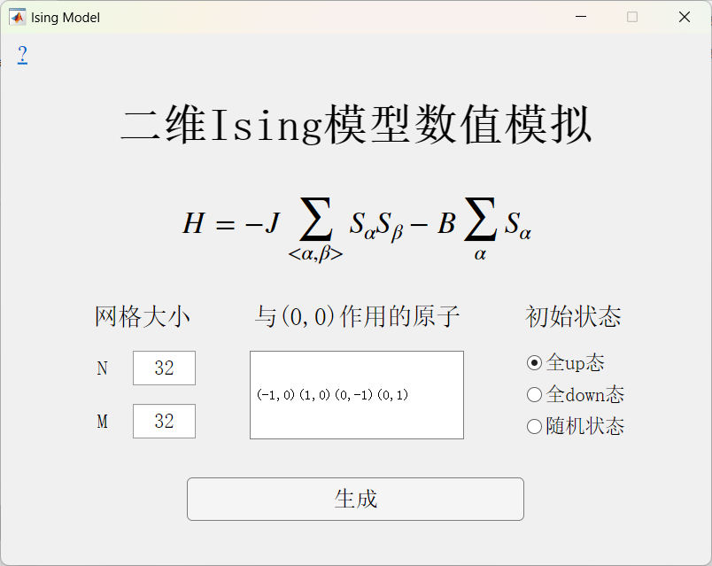
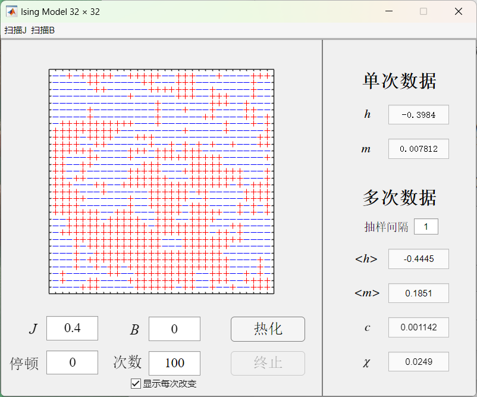

# 二维Ising模型数值模拟
基于Metropolis算法的程序实现

## 功能
- 可指定自旋作用的电子对<α,β>
- 可指定J，B，网格大小和热化参数，对当前格点进行热化
- 可实时显示当前格点的状态（二维点阵figure直观显示）
- 可实时输出当前系统的参量（平均能量h、平均自旋m）
- 可根据设定的抽样点计算其他参量（比热c、磁化率χ）
- 可设定扫描J和B记录一系列参数下的系统参量值，并绘制出变化曲线
- 可同时打开多个窗口，方便相互对比

## 示例

